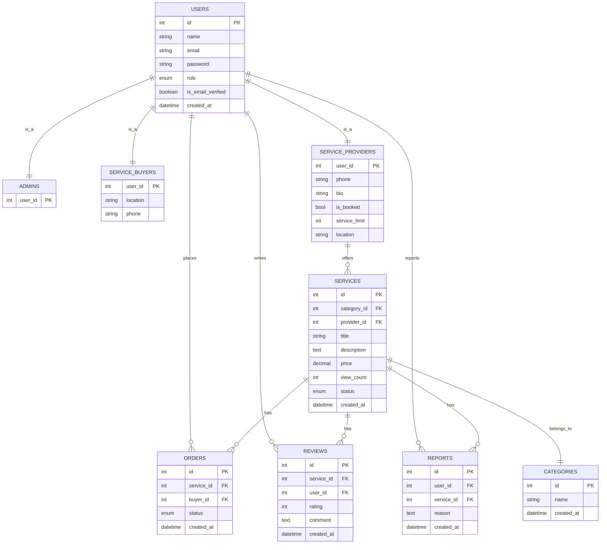

```mermaid
erDiagram
    USERS ||--|| ADMINS : is_a
    USERS ||--|| SERVICE_BUYERS : is_a
    USERS ||--|| SERVICE_PROVIDERS : is_a
    USERS ||--o{ ORDERS : places
    USERS ||--o{ REVIEWS : writes
    USERS ||--o{ REPORTS : reports
    SERVICES ||--o{ ORDERS : has
    SERVICES ||--o{ REVIEWS : has
    SERVICES ||--o{ REPORTS : has
    SERVICES ||--|| CATEGORIES : belongs_to
    SERVICE_PROVIDERS ||--o{ SERVICES : offers

    USERS {
        int id PK
        string name
        string email
        string password
        enum role
        boolean is_email_verified
        datetime created_at
    }

    ADMINS {
        int user_id PK
    }

    SERVICE_BUYERS {
        int user_id PK
        string location
        string phone
    }

    SERVICE_PROVIDERS {
        int user_id PK
        string phone
        string bio
        bool   is_booked
        int    service_limit
        string location
    }


    CATEGORIES {
        int id PK
        string name
        datetime created_at
    }

    SERVICES {
        int id PK
        int category_id FK
        int provider_id FK
        string title
        text description
        decimal price
        int view_count
        enum status 
        datetime created_at
    }

    ORDERS {
        int id PK
        int service_id FK
        int buyer_id FK
        enum status
        datetime created_at
    }

    REVIEWS {
        int id PK
        int service_id FK
        int user_id FK
        int rating
        text comment
        datetime created_at
    }

    REPORTS {
        int id PK
        int user_id FK
        int service_id FK
        text reason
        datetime created_at
    }
```